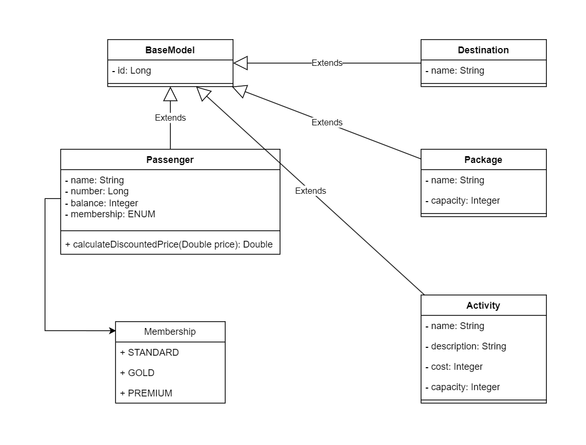
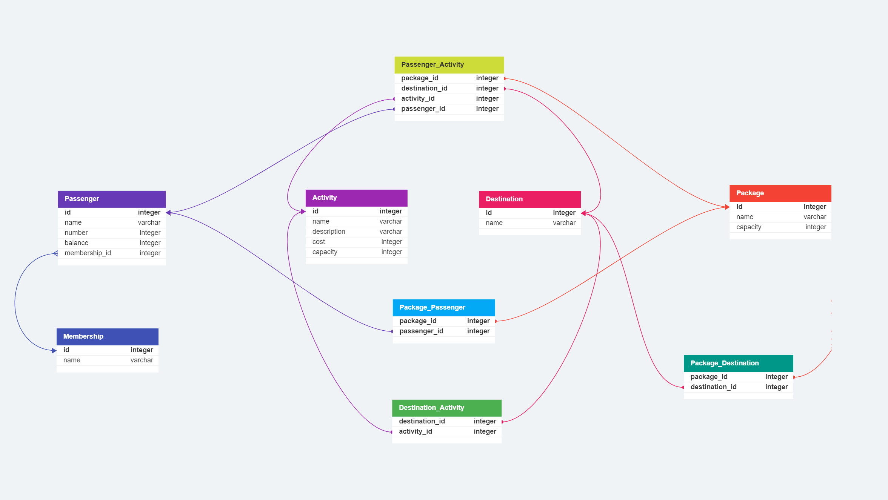
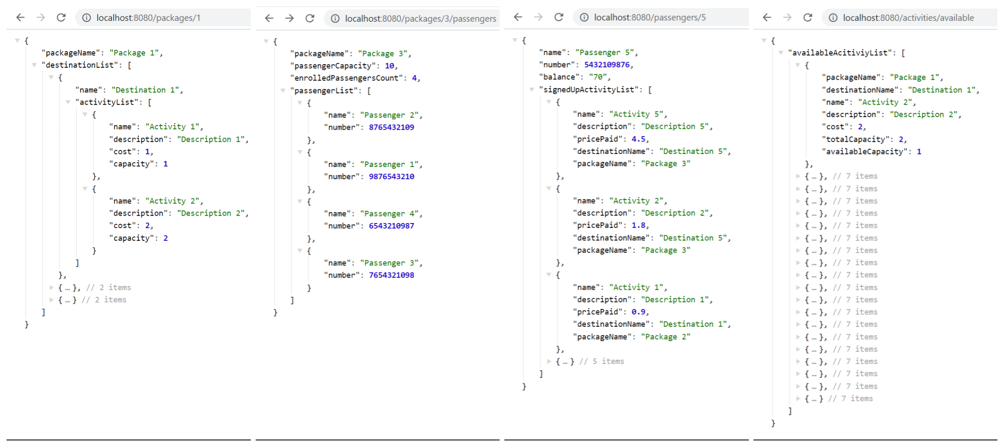

# Wanderlust

Wanderlust is a travel management system that allows users to explore various travel packages, destinations, and activities. It enables passengers to sign up for activities and helps them manage their travel plans.

## Table of Contents

- [Introduction](#introduction)
- [Features](#features)
- [Class Diagram](#Class_Diagram)
- [Database Design](#Database_Design)
- [Sample Output](#Sample_Output)
- [Prerequisites](#prerequisites)
- [Installation](#installation)
- [Usage](#usage)
- [Sample Data](#sample-data)
- [License](#license)

## Introduction

Wanderlust is a Spring Boot-based travel management system designed to assist travel agencies and customers in planning and booking travel packages. The system provides detailed information about available packages, destinations, and activities, and allows passengers to sign up for activities during their trip.

## Features

- View available travel packages and their details.
- Explore various destinations included in each package.
- Discover activities offered in each destination.
- Sign up for activities as a passenger.
- Calculate discounted prices for premium, gold, and standard members.
- Check the total capacity, enrolled capacity and available capacity for each available activity.

## Class_Diagram



## Database_Design



## Sample_Output



## Prerequisites

- Java Development Kit (JDK) 17 or higher.
- Apache Maven for building the project.
- Spring Boot and Spring Framework dependencies.

## Installation

To get the Wanderlust project up and running, follow these steps:

### Method 1: Manual Build

1. Clone the Wanderlust repository to your local machine.

```bash
git clone https://github.com/Kamaleshwaran-Valarmathi/Wanderlust.git
```

2. Open the project in your preferred Integrated Development Environment (IDE), such as IntelliJ IDEA, Eclipse.

3. Build the project within the IDE using the provided build options. This will compile the code and create the necessary target directories.

4. Run the main function in the `WanderlustApplication` class to start the application.

### Method 2: Using Maven

```bash
cd Wanderlust
mvn clean install
```

After building the project, you can run the application using Maven:

```bash
mvn spring-boot:run
```

Choose the method that suits you best to build and run the Wanderlust application. Once the application is up and running, you can access the provided endpoints to interact with the system.

## Usage

Once the application is up and running, you can access the following endpoints using `http://localhost:8080` as the base URL:

- `/` - This is the home page endpoint which lists all the available endpoints in this application. If you access an invalid endpoint, you will be redirected to this home page endpoint.

- `/packages/{packageId}` - Get details of a specific package by its ID, including package name, destinations and details of the activities available at each destination, like name, cost, capacity and description.

- `/packages/{packageId}/passengers` - Get a list of passengers enrolled in a specific package, including package name, passenger capacity, number of passengers currently enrolled and name & number of each passenger.

- `/passengers/{passengerId}` - Get details of a specific passenger by their ID, including their name, passenger number, balance (if applicable) and list of each activity they have signed up for, including the destination the at which the activity is taking place and the price the passenger paid for the activity.

- `/activities/available` - Get details of all the activities that still have spaces available for signing up as a passenger, including how many spaces are available.

Please replace `{packageId}` and `{passengerId}` with the desired IDs (i.e., 1 to 7 for testing) while accessing the endpoints.

## Sample Data

The Wanderlust application comes with pre-populated sample data for passengers, activities, destinations, and packages with IDs 1 to 7. Please note that this sample data is not well-structured or equally distributed, and it is intended for demonstration purposes only.

## License

Wanderlust is released under the [MIT License](https://opensource.org/licenses/MIT). Feel free to use and modify the code as per the terms of the license.
